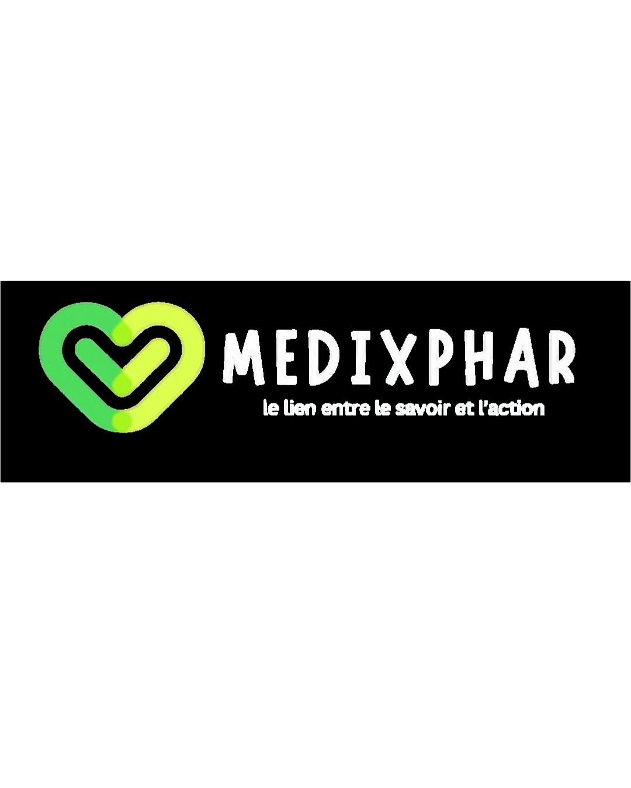

# 🧬 MedixPhar — Student Club Website

Official website of **MedixPhar**, a student club focused on **medicine, pharmacy, innovation, and community collaboration**.

The platform centralizes club activities, news, team members, partners, and student engagement in a modern and responsive interface.

---

# 🌐 Live Demo

🚀 Website:  
https://your-website-link.com

---

# 📌 Overview

MedixPhar website was developed to provide a **central digital platform** for the club where students can:

• Discover upcoming activities  
• Read the latest club news  
• Explore the team members  
• View partners and collaborators  
• Join the club easily  

The project focuses on **modern UI, performance, and simplicity**.

---

# ✨ Main Features

### 🎨 Modern UI
- Clean design
- Glassmorphism interface
- Smooth animations

### 🌙 Dark / Light Mode
User can toggle between dark and light theme.

### 🌍 Multi-language Support
- French
- English

### 📰 Dynamic News System
News is managed through **Google Sheets** and fetched automatically.

### 📅 Events Section
Interactive slider displaying club activities.

### 👥 Team Section
Presentation of the club members.

### 🤝 Partners Slider
Animated partners carousel.

### 📹 Video Integration
Embedded video presentation.

### 📩 Join Form
Users can join the club through a **Google Form integration**.

---

# 🧠 How the News System Works

The news system is **fully dynamic**.

# Workflow:

Google Sheets
↓
Google Apps Script API
↓
Website fetch() request
↓
News section updates automatically

Admins can publish news **without modifying the website code**.

---

# 🧰 Technologies Used

Frontend

• HTML5  
• CSS3  
• JavaScript (Vanilla JS)

Integration

• Google Sheets  
• Google Apps Script API

Design

• Glassmorphism UI  
• Responsive Layout  
• CSS Animations

---

# 📁 Project Structure
medixphar/
│
├── index.html
├── about.html
├── events.html
├── news.html
│
├── assets
│ ├── css
│ │ └── style.css
│ │
│ ├── js
│ │ ├── main.js
│ │ └── news.js
│ │
│ ├── img
│ │ ├── logo.png
│ │ └── images
│
└── README.md

---

# 📱 Responsive Design

The website is fully responsive and optimized for:

✔ Desktop  
✔ Tablet  
✔ Mobile

---

# 🚀 Future Improvements

Planned upgrades for the platform:

• Admin dashboard  
• Event registration system  
• Member management system  
• Newsletter integration  
• Blog / Articles system  
• Advanced analytics  

---

# 👨‍💻 Development

This project was built as a **student club platform** to showcase activities and improve digital communication within the community.

---

# 🤝 Contribution

Contributions are welcome.

If you want to improve the project:

1️⃣ Fork the repository  
2️⃣ Create a new branch  
3️⃣ Commit your changes  
4️⃣ Open a Pull Request

---

# 📄 License

This project is intended for **educational and community purposes**.

---

# 💙 MedixPhar

**Building a community that learns, acts, and creates impact.**
